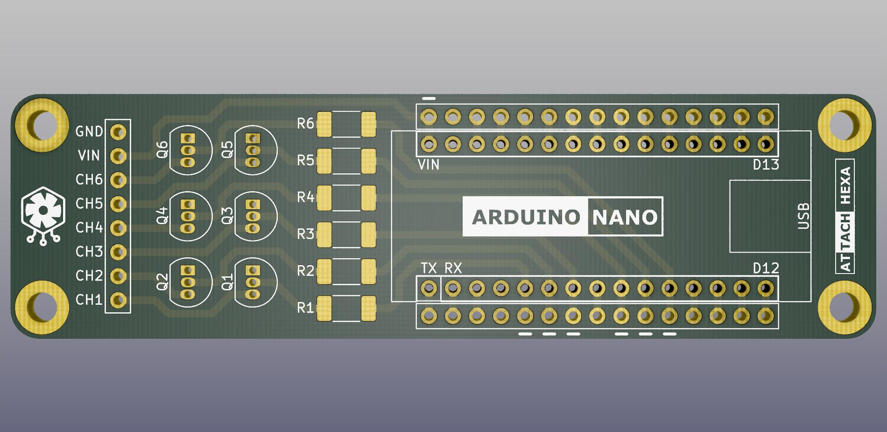

# 
Highly configurable, low-cost solution to produce fake cooling fan TACH signals for various computer systems.

## Description
Attach-Hexa is a combined circuit board, which consists of three parts:
* Custom pcb with a few cheap parts, mounting holes & socket to a replaceable microcontroller
* Arduino Nano or any clone with the same pinout
* Code running on Arduino to handle outputs in a flexible way

With the code uploaded to the Arduino, a complete Attach-Hexa is able to drive six computer fan headers with TACH signals. 

