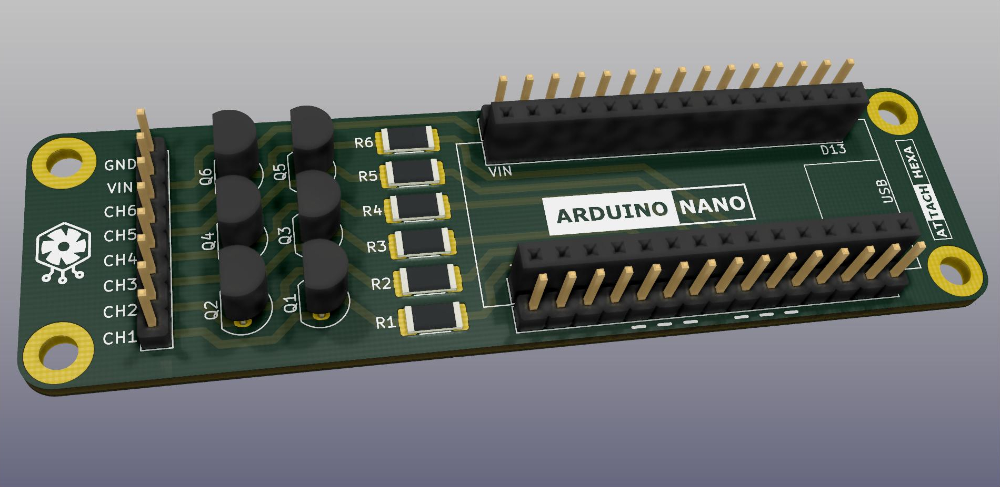
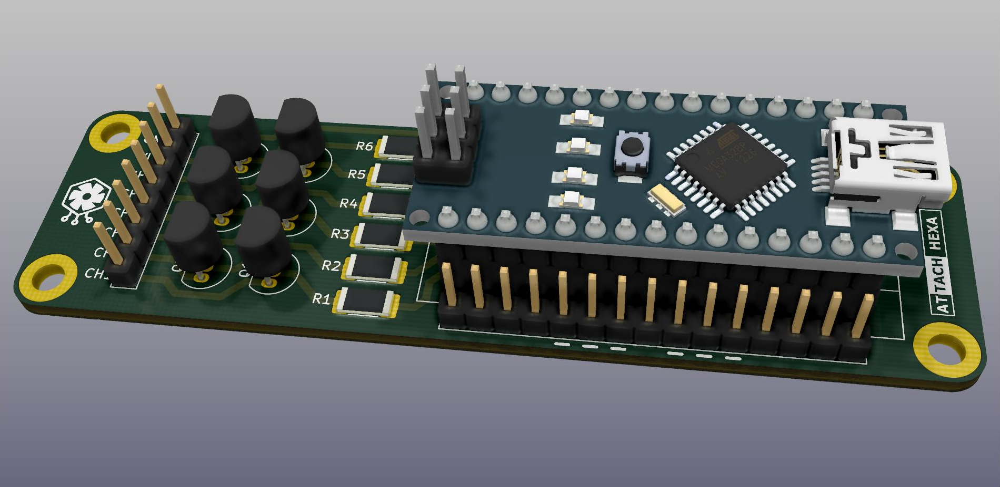
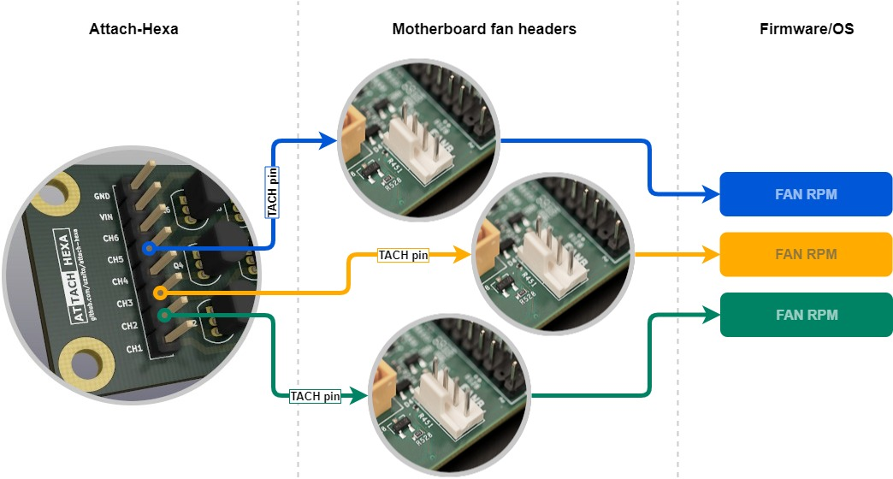

# 
Highly configurable, low-cost solution to produce fake cooling fan TACH signals for various computer systems.

## Description
Attach-Hexa is a combined circuit board, which consists of three parts:
* Custom pcb with a few cheap components, mounting holes & socket for a replaceable microcontroller
* Arduino Nano or any clone with the same pinout
* Code running on Arduino to handle outputs in a flexible way

With the code uploaded to the Arduino, a complete Attach-Hexa is able to drive six computer fan headers (channels) with TACH signals. Users can easily adjust the required RPM simulation on each channel, using pre-defined commands on serial interface.

## Do I need this?
If you have a conventional computer system with ordinary cooling, you don't. However, Attach-Hexa can be useful in the following cases:
* In passively cooled, modded enterprise systems (e.g. home lab), where elimination of "missing fan" alerts is needed to prevent undesired behaviour and ensure proper booting of the system (many servers do not boot at all, if fans are not present)
* In any system with water cooling, where RPM simulation is handy for tuning or testing the setup
* In PWM operation analysis, or other similar hardware development procedure
* In any other case, where generating square-waves is helpful
