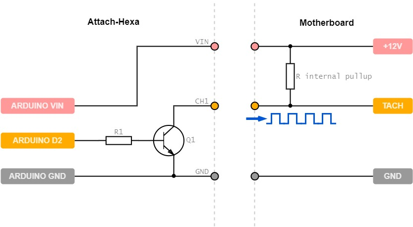

#  

## Description
This project is a configurable low-cost solution to produce fake cooling fan TACH signals for various computer systems. It consists of three main parts:
* Custom pcb with a few cheap components, mounting holes & socket for a replaceable microcontroller
* Arduino Nano or any clone with the same pinout
* Code running on Arduino to handle outputs in a flexible way

With the code uploaded to Arduino, a complete Attach-Hexa is able to drive six computer fan headers (channels) with TACH signals. Users can easily adjust the required RPM simulation on each channel, using pre-defined commands on serial interface.

## Do I need this?
If you have a conventional computer system with ordinary cooling, you don't. However, Attach-Hexa can be useful in the following cases:
* In passively cooled, modded enterprise systems (e.g. home lab), where elimination of "missing fan" alerts is needed to prevent undesired behaviour and ensure proper booting of the system (many servers do not boot at all, if fans are not present)
* In any system with water cooling, where RPM simulation is handy for tuning or testing the setup
* In PWM operation analysis, or other similar hardware development procedure
* In any other case, where generating square-waves is helpful

## Technical Details
TACH signals are used to report the current RPM of cooling fans to the system. Each fan has a dedicated pin for this purpose, usually in the following pinout:

On most motherboard headers, TACH pin is pulled high (+10-12V) by an internal pullup resistor. As the connected fan rotates, it's own built-in electronics (hall-effect sensor, transistor) pulls the TACH line to GND twice in every revolution. This results in a square-wave with a certain period, which is proportional to the fan's rotation speed. So if we would like to reproduce this, we have to pull that pin low at a specified rate. Arduino and similar microcontrollers can do that easily from code. The following schematic represents square-wave generation on channel 1:

The custom pcb board is holding the Arduino Nano, and makes it capable of pulling +12V (or more) lines safely through transistors. The entire unit can be powered from any fan header (using GND & VIN pins) up to +12V, or from USB. The power source is automatically selected to the highest voltage.

## Features
* Six simultaneously working channels
* Built-in LED can be linked to any channel as a visual tracker
* Desired RPMs, LED linked channel and LED frequency settings can be adjusted at runtime
* Serial interface listener to receive commands
* All settings can be saved to EEPROM to survive reboots
* Easily accessible Nano pin headers for potential new features, reserved pins marked on silkscreen

## PCB BOM
The following components are needed to assemble the custom pcb.

| Component  | Type | Package | Value | Quantity |
| ---------- | ---- | ------- | ----- | -------- |
| R1-R6 | Resistor | SMD-2010 | 4.7kΩ | 6 | 
| Q1-Q6 | Transistor | TO-92 | 2N3904 | 6 | 
| Pin header | Connector | 2.54mm single row | 8-pin male | 1 |
| Pin header | Connector | 2.54mm single row | 15-pin male | 2 |
| Pin socket | Connector | 2.54mm single row | 15-pin female | 2 |

Note: 2N3904 can handle collector current up to 10mA with base resistor 4.7kΩ by forced saturation (current flows from TACH pin to GND through transistor C-E). It is possible to substitute transistors with another type, but keep in mind you have to recalculate base resistor values in this case.

## Serial interface
You can manage Attach-Hexa over serial. Connect USB cable to Arduino, and use any terminal program with the following settings:
* Baud Rate: 115200 | Data: 8bit | Parity: none | Stop bits: 1bit | Flow control: none 
* Local echo: on | New line transmit marker: CR, LF or CR+LF 

Available commands:
* Set any channel RPM: `/channel 2 4000`
* Link LED to channel: `/led link 2`
* Adjust LED delay multiplier to get visible blinking: `/led multi 60`
* Print current settings to terminal: `/print`
* Save current settings to EEPROM: `/save`

| Command element  | Min | Max |
| ---------------- | --- | --- |
| Channel number | 1 | 6 |
| Channel RPM | 1 | 32767 |
| LED link | 1 | 6 |
| LED multiplication | 1 | 255 |

## Assembly and application
1. Clone or download this repository.
2. Plot the custom pcb to gerber files using the included KiCAD project. Any chinese manufacturer (JLPCB, ALLPCB, PCBWAY, etc.) can fabricate a copy from gerber for a couple dollars. Really, it's dirt cheap.
3. Once you got the pcb and the few listed components, assemble Attach-Hexa by hand soldering, no special tool needed.
4. Upload the provided code to an Arduino Nano using Arduino IDE (with [EEPROMex](https://github.com/thijse/Arduino-EEPROMEx) lib installed), and put the Nano in the socket.
5. Connect your terminal application to USB port and use the commands to achieve the desired settings. Save to EEPROM.
6. Place Hexa in the computer you would like to control, and make sure it is powered from that machine's USB port or fan header. Common GND is very important to pull TACH lines properly.
7. Attach channel pins to required TACH pins with dupont wires, and check the simulated RPM in the BIOS/UEFI or OS.
